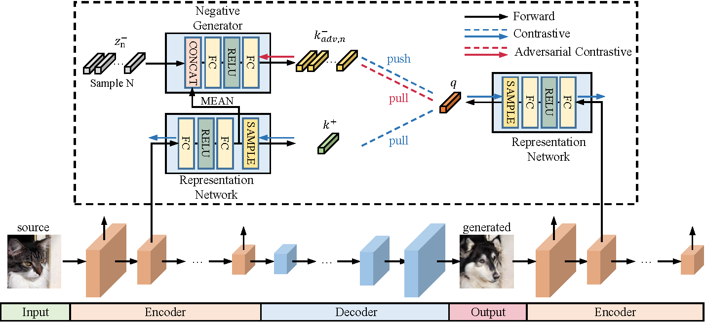
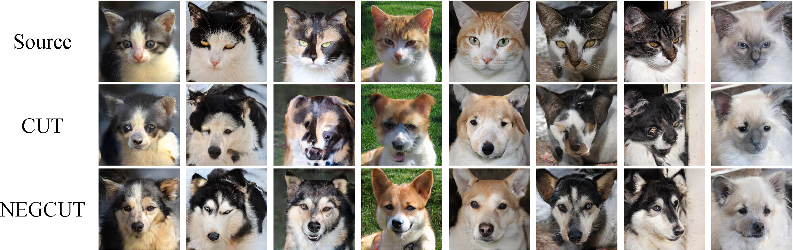
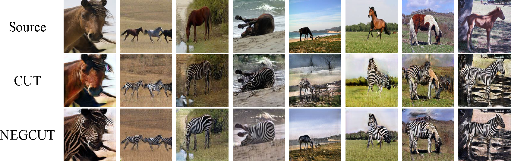
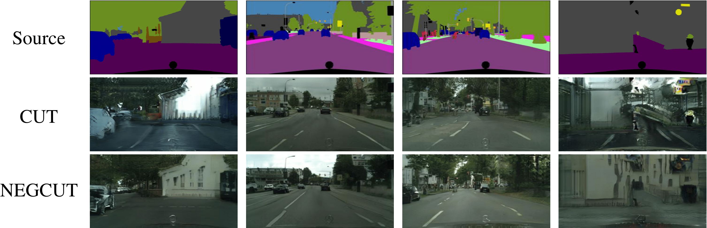

# Instance-wise Hard Negative Example Generation for Contrastive Learning in Unpaired Image-to-Image Translation (NEGCUT) 

<br>

  

<br><br><br>


We provide our PyTorch implementation of Instance-wise Hard Negative Example Generation for Contrastive Learning in Unpaired Image-to-Image Translation (NEGCUT). 
In the paper, we identify that the negative examples play a critical role in the performance of contrastive learning for image-to-image translation.
We train a generator to generate negative examples online through adversarial learning to enhance the performance of contrastive learning in unpaired image-to-image translation.
Compared to CUT, our model achieves superior performances on three benchmark datasets with the same inference speed.


## Example Results
* **Cat->Dog:**

<p align='center'>  
  
</p>

* **Horse->Zebra:**

<p align='center'>  
  
</p>

* **Cityscapes:**

<p align='center'>  
  
</p>

## Prerequisites
- Linux
- Python 3
- CPU or NVIDIA GPU + CUDA CuDNN

### Getting started

- Install PyTorch and other dependencies (e.g., torchvision, visdom, dominate, gputil).

  For pip users, please type the command `pip install -r requirements.txt`.

  For Conda users,  you can create a new Conda environment using `conda env create -f environment.yml`.

### NEGCUT Training and Test

- Download the `cityscapes` dataset.
```bash
bash ./datasets/download_cut_dataset.sh cityscapes
```

Preprocess the `cityscapes` dataset with the scripts `datasets/prepare_cityscapes_dataset.py`.
```bash
python prepare_cityscapes_dataset.py --gitFine_dir ./gtFine/ --leftImg8bit_dir ./leftImg8bit --output_dir ./datasets/cityscapes/
```

The dataset will be saved at `./datasets/cityscapes/`.

- To view training results and loss plots, run `python -m visdom.server` and click the URL http://localhost:8097.

- Train the NEGCUT model:
```bash
python train.py --dataroot ./datasets/horse2zebra --name CITY_NEGCUT --NEGCUT_mode NEGCUT --model negcut
```
The checkpoints will be stored at `./checkpoints/CITY_NEGCUT/web`.

- Test the CUT model:
```bash
python test.py --dataroot ./datasets/cityscapes --name CITY_NEGCUT --NEGCUT_mode NEGCUT --model negcut --phase test
```

The test results will be saved to a html file here: `./results/cityscapes/latest_train/index.html`.

### Apply a pre-trained NEGCUT model and evaluate

The pretrained models will be released soon.

- To evaluate the model, first generate the test results:
```bash
python test.py --dataroot ./datasets --name MODEL_NAME --NEGCUT_mode NEGCUT --model negcut --phase test
```

- To calucate FID metric, you should clone [pytorch-fid](https://github.com/mseitzer/pytorch-fid) and run:
```bash
python fid_score.py GENERATED_IMAGES_DIR REAL_IMAGE_DIR
```

- To calcuate mAP, PixAcc and ClsAcc metrics, you should clone [drn](https://github.com/fyu/drn) and apply the pre-trained drn-d-22 model at `assets/drn/drn_d_22.pth.tar` for the resolution of 128x256 (will be released soon):
```bash
python segment.py test -d <data_folder> -c 19 --arch drn_d_22 --batch-size 1 --resume assets/drn/drn_d_22.pth.tar --phase val --with-gt
```
To evaluate your generated images, you need to arrange your generated results like the cityscapes dataset, refer `drn/datasets/cityscapes/prepare_data.py` for more details.

### Datasets
Refer [Datasets](./docs/datasets.md) to learn more details about datasets used and how to create your own datasets 

### Acknowledge
Our code is developed based on [CUT](https://github.com/taesungp/contrastive-unpaired-translation). We also thank [pytorch-fid](https://github.com/mseitzer/pytorch-fid) for FID computation, [drn](https://github.com/fyu/drn) for mIoU computation.
